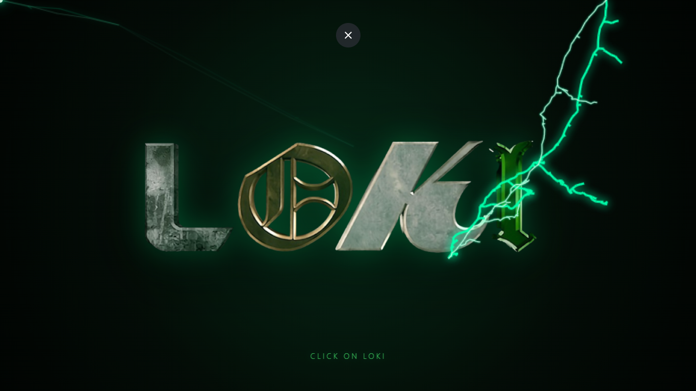

# PRINCEKUMAR-DEV74 | LOKI - GREENMAGIC

<p align="center">
  <a href="#" target="_blank">
    
  </a>
</p>

```
██╗      ██████╗ ██╗  ██╗ ██╗
██║     ██╔═══██╗██║ ██╔╝ ██║
██║     ██║   ██║█████═╝  ██║
██║     ██║   ██║██╔═██╗  ██║
███████╗╚██████╔╝██║  ██╗ ██║
╚══════╝ ╚═════╝ ╚═╝  ╚═╝ ╚═╝

>> NAME: LOKI-GreenMagic
```
<p align="center">
    
    
</p>

---

## ╰┈➤ Key Features

* **⚡ Procedural Lightning Effect:** Real-time green thunder strikes generated dynamically on HTML5 Canvas using recursive displacement algorithms.
* **🌀 WebGL Custom Shader Transitions:** Custom GLSL shaders powered by **Three.js** that handle organic screen-wipe and radial energy explosion transitions.
* **🖱️ Dynamic Custom Cursor & Trail:** Interactive glowing cursor with electric spark trail effects that react to mouse speed and hover states.
* **👁️ Interactive Parallax:** Dynamic mouse and touch-driven 3D parallax tilt effect on featured artwork during reveal states.
* **📱 Fully Responsive & Touch Optimized:** Custom touch handling for mobile devices with automatic custom cursor fallback.

---

## ╰┈➤🛠️ Tech Stack & Dependencies

| Technology | Purpose | Source / CDN |
| :--- | :--- | :--- |
| **HTML5 / CSS3** | Structural Layout & Cyberpunk/Green Theme Styling | Native |
| **JavaScript (ES6 Modules)** | Core Logic & Animation Timing | Native |
| **Three.js (v0.178.0)** | WebGL Rendering & Custom Shader Material | `unpkg.com` Import Map |
| **GSAP (v3.12.5)** | Smooth UI Tweens, Scales, & State Animations | `cdnjs.cloudflare` |

---


## ╰┈➤📂 Project Structure

```text
├── assets/
│   ├── favicon.ico
│   ├── preview.png
│   ├── Home.png
│   └── Loki.png
├── index.html
├── style.css
├── script.js
└── README.md
```
---

## ╰┈➤ CONNECT

<p align="center">
  <a href="https://webkaizen.in"></a>
  <a href="https://github.com/princekumar-dev74"></a>
  <a href="https://www.youtube.com/@YOUR_CHANNEL"></a>
  <a href="https://instagram.com/webkaizen"></a>
</p>

---

## ╰┈➤ CONTACT

**TRANSMISSION OPEN:**
- **MAIL**: `officialwebkaizen@gmail.com`
- **GITHUB**: `princekumar-dev74`

---
**© 2026 PRINCE**
